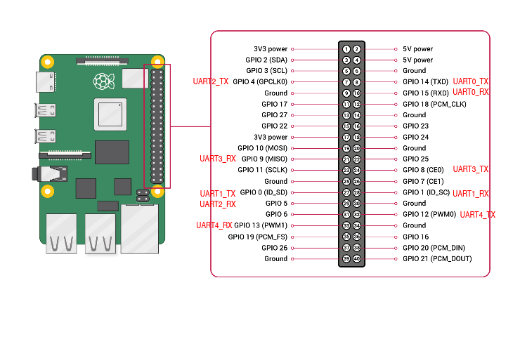

# Test USB Substitution with UART

This document explains how to configure the Raspberry Pi 5 so that its hardware UART interfaces can be used. The aim is to replace the current USB connection between the Raspberry Pi and the ESP32 with a UART connection. This is because the USB-C plug exerts a lot of force on the USB-C socket. When the pilot is sitting in the bike, her legs can accidentally rip these connections out. Therefore, the USB-C socket was desoldered and the USB connection was soldered directly onto the ESP32 dev board. While this works, it means that the ESP32 cannot be hot-swapped if it breaks. Ideally, all connections to the ESP32 would be made through its header pins. 

Currently, the Raspberry Pi connects to the CH340C USB transceiver chip on the ESP32 dev board via USB, and this chip converts the signal into UART. The same UART0 interface (GPIO1 TX0 and GPIO3 RX0) is available on ESP32 header pins 34 and 35. Therefore, the same UART interface can be used for the connection between the Raspberry Pi and the ESP32 via UART. There is no need to use USB for bare data transmission. 

To test that data can safely be transmitted between the Raspberry Pi and the ESP32 via UART, the class SafeUART has been written for the ESP32 in C++ and for the Raspberry Pi in Python. All the code for this test is located on the GitHub branch: *test_substituting_usb_with_uart*.

The code for the Raspberry Pi is located at:

```MQSPEED-CODEBASE\version_control\Testing Python Scripts\UART_Testing```

The code for the ESP32 is located at:

```MQSPEED-CODEBASE\version_control\Testing Arduino Scripts\UART_Testing\gearbox_exp32\src```

The ESP32 code has been written with the platformIO framework in VS Code. 

**Important**: Currently, it is not possible to program the ESP32 through the UART interface from the Raspberry Pi. For this, the USB connection needs to be used. Therefore, the UART connection is not a direct substitute for the current USB connection.

## Raspberry Pi 5 Configuration
- UART0: Used for serial console
- UART2: TX GPIO4, RX GPIO5
- UART3: TX GPIO8, RX GPIO9
- UART4: TX GPIO12, RX GPIO13



Boot config file needs to be changed on Raspberry pi 5:

```sudo nano /boot/firmware/config.txt```

At the very end of the file add the lines for UART configuration:

```
dtoverlay=uart2
dtoverlay=uart3
dtoverlay=uart4
```

For the changes to take effect, restart the Pi:

```sudo reboot```

To check which pins on the J8 header are configured as UART run the following command:

```pinctrl```

To find out which device is active run the following commands:

```
cd /dev/
ls
```

The UART interfaces are usually called "ttyAMAx". So UART2 would be "ttyAMA2".

## SafeUART C++ Class ESP32

`SafeUART` is a lightweight reliability layer built on top of the Arduino `Stream` interface.  
It enhances standard UART communication by adding **CRC-based error detection**, **ACK/NAK handshaking**, and **automatic retransmission**.

---

### ✨ Features

- **CRC8-ATM Error Detection**
  - Ensures data integrity using a lookup-table-based CRC.
  
- **Framed Communication**
  - All messages follow a simple structure:

    ```[payload][CRC][\n]```

- **ACK / NAK Handshake**
  - `ACK (0x06)` → Data received successfully
  - `NAK (0x15)` → Data corrupted or invalid

- **Automatic Retransmission**
  - Failed transmissions are retried once automatically.

- **Timeout Handling**
  - Configurable timeout (`ack_timeout`) for waiting on acknowledgments.

- **Buffer Protection**
  - Maximum message size enforced (`maxBufferLen = 128 bytes`)

---

## 📦 Protocol Overview

### Transmission Format
Sender → Receiver:
```[payload][CRC][\n]```


### Receiver Response

ACK Packet:
```[0x06][CRC][\n]```

NAK Packet:
```[0x15][CRC][\n]```


---

## 🔧 Class Interface

### Constructor
```cpp 
SafeUART(Stream& s);
```

Initializes the SafeUART instance using a given Stream object. In this case a HardwareSerial object is used.

---

### ```sendData()```
```cpp
int16_t sendData(uint8_t* sendBuffer, size_t sendBufferLen);
```
Sends data with CRC and terminator.
Does not wait for acknowledgment.

#### Returns:

- ```> 0``` → Number of bytes sent
- ```-1``` → Error (buffer too large)

---

### ```receiveData()```

```cpp
int16_t receiveData(uint8_t* receiveBuffer, size_t receiveBufferLen);
```
Reads incoming data until ```\n```
Validates CRC
Sends ACK or NAK automatically

#### Returns:

- ```> 0``` → Number of bytes received (includes \n, CRC replaced)
- ```0``` → No data available
- ```-1``` → Error (overflow or CRC failure)

---

### ```sendSafeData()```

```cpp
int16_t sendSafeData(uint8_t* sendBuffer, size_t sendBufferLen);
```
- Sends data with CRC
- Waits for ACK response
- Retries once on failure or timeout

#### Returns:

- ```> 0``` → Number of bytes sent
- ```-1``` → Transmission failed

---

### ⏱ Timeout Configuration
```cpp
unsigned long ack_timeout = 100; // milliseconds
```

Defines how long to wait for an ACK before retrying.

---

### 📏 Limits
| Parameter       | Value                      |
| --------------- | -------------------------- |
| Max buffer size | 128 bytes                  |
| Retries         | 1 retry (2 attempts total) |
| Terminator      | `\n`                       |

The max. buffer size can be increased in the class code.

---
### 🚀 Example Usage

```cpp
#include <Arduino.h>
#include "SafeUART.h"

SafeUART uart(Serial);      // Wrap safeUART connection around Serial connection (CRC check for data transmission)

void setup() {
    Serial.begin(115200);
}

void loop() {
    char msg[128] = "";
    int msgLen = sprintf(msg, "g,%i,bg,%i", gear, millis());


    // Send safely
    if (uart.sendSafeData((uint8_t *)msg, msgLen) > 0) {
        // Success
    }

    // Receive
    uint8_t buffer[128];
    int len = uart.receiveData(buffer, sizeof(buffer)/sizeof(buffer[0]));

    if (len > 0) {
        // Process received data
    }
}
```

### Notes
- Assumes a reliable lower-level UART configuration (baud rate, parity, etc.)
- Does not implement advanced features like:
  - Packet IDs
  - Sequencing
  - Flow control beyond ACK/NAK

---

## SafeUART Python Class Raspberry Pi

`SafeUART` is a lightweight reliability layer built on top of a `pyserial` (`serial.Serial`) interface.  
It enhances standard UART communication by adding **CRC-based error detection**, **ACK/NAK handshaking**, and **automatic retransmission with timeout**.

---

## ✨ Features

- **CRC8-ATM Error Detection**
  - Ensures data integrity using a lookup-table-based CRC.

- **Framed Communication**
  - All messages follow a simple structure:

    ```[payload][CRC][\n]```

- **ACK / NAK Handshake**
  - `ACK (0x06)` → Data received successfully  
  - `NAK (0x15)` → Data corrupted or invalid  

- **Automatic Retransmission**
  - Failed transmissions are retried once (`send_safe_data()`).

- **Timeout Handling**
  - Configurable ACK timeout using `ack_timeout`.

- **Buffer Protection**
  - Maximum message size enforced (`max_buffer_len = 128 bytes`).
  - *Info*: Can be removed for future purposes. This is only included, since this class was ported from C++.


---

## 📦 Protocol Overview

### Transmission Format
Sender → Receiver:

```[payload][CRC][\n]```


### Receiver Response

ACK Packet:
```[0x06][CRC][\n]```

NAK Packet:
```[0x15][CRC][\n]```


---

## 🔧 Class Interface

### Constructor

```python
SafeUART(serial_port: serial.Serial, ack_timeout: float = 1.0)
```

- `serial_port` → An initialized `serial.Serial` instance
- `ack_timeout` → Time (in seconds) to wait for ACK

### `send_data()`
```python
def send_data(self, send_buffer: bytes) -> int | None:
```

- Sends data with CRC and terminator.
- Does not wait for acknowledgment.

#### Returns:

- `int` → Number of bytes sent
- `None` → Error (buffer too large)

---

### `receive_data()`
```python
def receive_data(self) -> bytes | None:
```

- Reads incoming data until `\n`
- Validates CRC
- Sends ACK or NAK automatically

#### Returns:

- `bytes` → Received payload (includes `\n`)
- `None` → No data, buffer overflow, or CRC error

---

### `send_safe_data()`
```python
def send_safe_data(self, send_buffer: bytes) -> int | None:
```

- Sends data with CRC
- Waits for ACK response
- Retries once on failure or timeout

#### Returns:

- `int` → Number of bytes sent
- `None` → Transmission failed

---

### ⏱ Timeout Configuration
```python
ack_timeout = 1.0  # seconds
```

Defines how long to wait for an ACK before retrying.

---

### 📏 Limits
| Parameter       | Value                      |
| --------------- | -------------------------- |
| Max buffer size | 128 bytes                  |
| Retries         | 1 retry (2 attempts total) |
| Terminator      | `\n`                       |

---

### 🚀 Example Usage
```python
import serial
from SafeUART import SafeUART

if __name__ == '__main__':
    uart = SafeUART(serial.Serial(port='/dev/ttyAMA3', baudrate=115200, timeout=1, parity=serial.PARITY_NONE, stopbits=serial.STOPBITS_ONE, bytesize=serial.EIGHTBITS))

    uart.serial.open()

    # Send safely
    if uart.send_safe_data(b'Hello'):
        print("Sent successfully")

    # Receive
    data = uart.receive_data()
    if data:
        print("Received: ", data)
```
---

⚠️ Notes
- Requires a properly configured pyserial interface
- `read_until()` (inside receive_data) may return partial data on timeout — protocol assumes well-formed packets
- No advanced features like:
  - Packet IDs
  - Sequencing
  - Flow control beyond ACK/NAK

---

### License

Written by Pascal Brülhart
pascal.bruelhart@proton.me